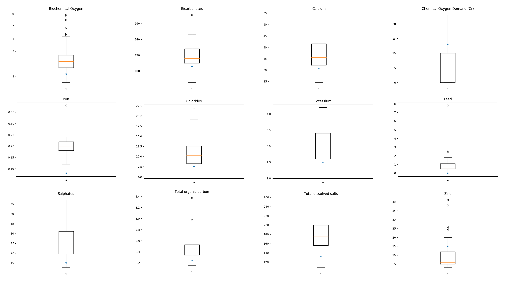
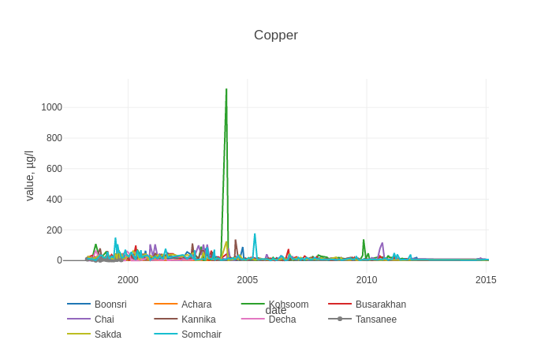
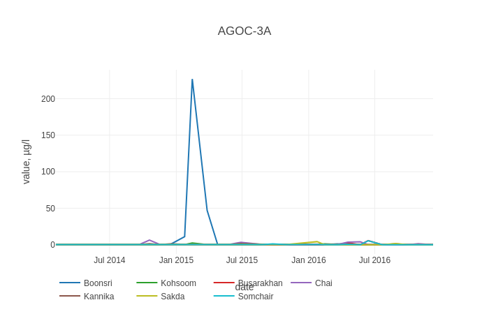
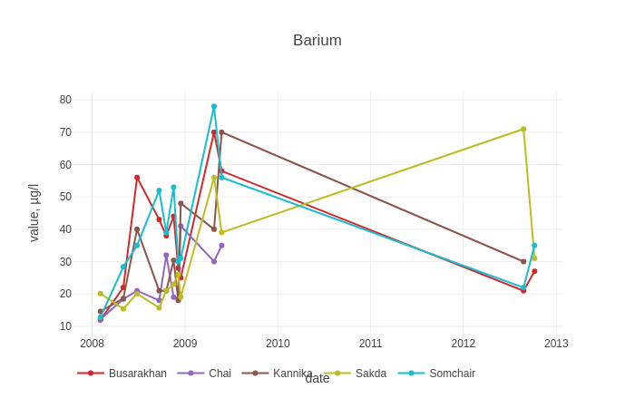
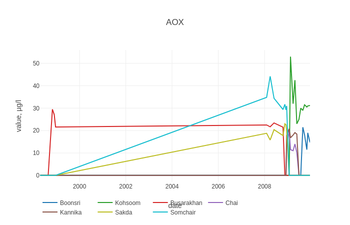
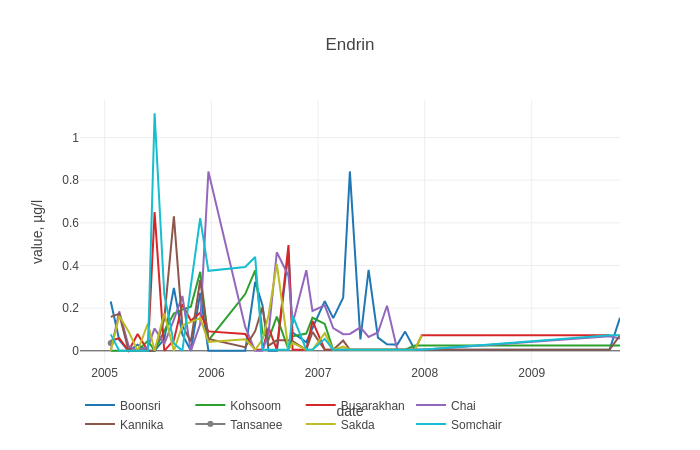
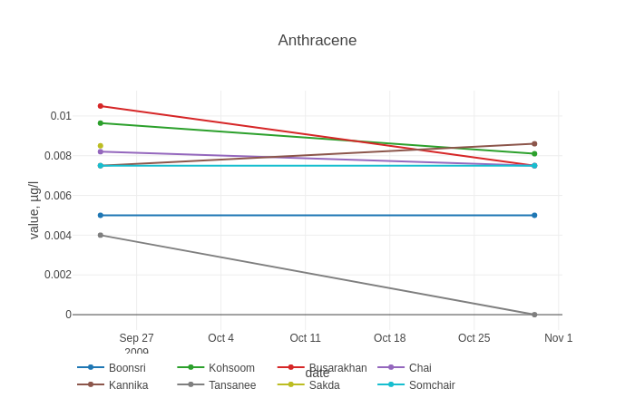
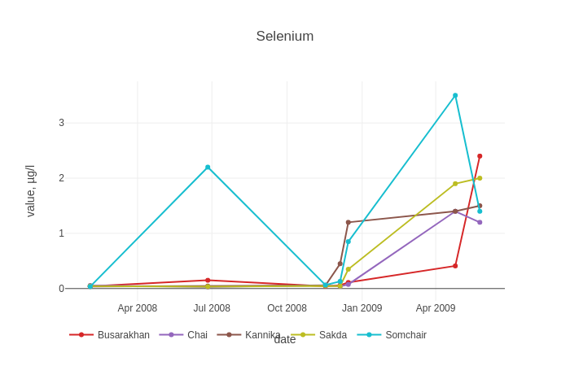

# VAST CHALLENGE 2018 MC2

1. Characterize the past and most recent situation with respect to chemical contamination in the Boonsong Lekagul waterways. Do you see any trends of possible interest in this investigation? Your submission for this questions should contain no more than 10 images and 1000 words.

   In this part, we will show the trends of recent chemical contamination changes by region.  We use boxplot display the past situation and use star points to indicate the most recent situation. For each region we choose the different situations without showing the normal trends.

   - Achara 

     From the plot below, we can see that the most recent Biochemical Oxygen is lower than the past situation. And the Bicarbonates is below the normal level. The Calcium is a little lower than the normal level. The Chemical Oxygen Demand(Cr) is higher than the normal level. The iron is the most lowest record in the past.   The Chlorides, Potassium and Lead are a little lower than the normal level. The Sulphates, Total organic carbon and Total dissolved salts are also lower than the normal level. The Zinc is higher than the normal level.

     

   - Boonsri

     From the plot below, we can see that the Magnesium and Dissolved silicates are both lower than their normal level. The Anionic active surfactants and Dissolved oxygen and total hardness are higher than their normal level. The Oxygen saturation is a little higher than the normal level. The Silica (SiO2) is a lot higher than the normal level. In a word, the most recent chemical contamination is generally higher than the past.

     

   - Busarakhan

     From the plot below, we can see that the Mercury, Dissolved silicates, Potassium, Silica and Total nitrogen are lower than their normal levels. The Oxygen saturation, Arsenic and Total hardness are higher than their past situation. 

     

   - Chai

     From the plot below, we can see that the Anionic active surfactants is lower than the normal level.  The Arsenic, Calcium, Total dissolved salts, Total hardness and Total organic carbon are blow their normal level.

     

   - Kannika

     From the plot below, we can see that the Chlorides and Sulphates are lower than their normal level.  The Arsenic, Calcium, Dissolved oxygen, Dissolved silicates, Bicarbonates and Total hardness are higher than their normal level.

     

   - Kohsoom

     From the plot below, we can see that the Ammonium, Arsenic, Mercury, Chlorides, Water temperature, Total nitrogen, Oxygen saturation, Nitrites, Sulphates, Total dissolved salts and Potassium are lower than normal level. The Anionic active surfactants is higher than the normal level.

     

   - Sakda

     From the plot below, we can see that the Arsenic, Biochemical Oxygen, Chemical Oxygen Demand(Cr), Dissolved Oxygen, Dissolved silicates, Total hardness, Total organic carbon and Oxygen saturation are higher than their normal level.

     

   - Somchair

     From the plot below, we can see that the Biochemical Oxygen, Anionic active surfactants, Sulphates, Potassium, Dissolved silicates are lower than their normal level. The Dissolved oxygen, Total hardness, Total dissolved salts and Chlorides are higher than their normal level.

     

   - Tansanee

     From the plot below, we can see that the Total organic carbon, Calcium is higher than the normal level. The Manganese, Lead, Iron and Copper are lower than the normal level. 

     

     ​

2. What anomalies do you find in the waterway samples dataset?How do these affect your analysis of potential problems to the environment? Is the Hydrology Department collecting sufficient data to understand the comprehensive situation across the Preserve? What changes would you propose to make in the sampling approach to best understand the situation?Your submission for this question should contain no more than 6 images and 500 words.

   We found that in the dataset, some data is abnormally higher than normal data. This shows the change in copper content in the past. We found that around 2005, the copper content suddenly increased, far exceeding the usual level. We think this is an anomaly, which may be abnormality in data logging or an error in data detection. 

   

   This is the chart of AGOC-3A content in the past years, it has an abnormally high abnormal data, which we think is also one of the errors. More over, the data in most areas is basically zero, and basically not changed. We believe that such data doesn't have much reference value.

   

   These anomalies affect our analysis, and we may treat anomalous data as an increase or decrease in the content of certain chemical elements. 

   

   

   

   

   ​

   ​

   ​

   ​

   ​

   

3. After reviewing the data, do any of your findings cause particular concern for the Pipit or other wildlife? Would you suggest any changes in the sampling strategy to better understand the waterways situation in the Preserve? Your submission for this question should contain no more than 6 images and 500 words.

